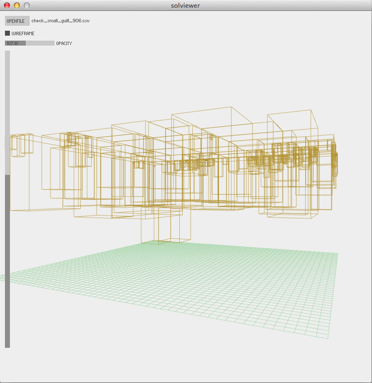

Kaggle Packing Santa's Sleigh
==========================

This repository contains the [Julia](http://julialang.org) sources for
my solution to the Kaggle 
[Packing Santa's Sleigh](http://www.kaggle.com/c/packing-santas-sleigh)
competition. The challenge consisted of packing one million presents
of varying sizes in delivery order into Santa's fixed length and width
sleigh with the least height. The task is essentially a 
[bin packing problem](http://en.wikipedia.org/wiki/Bin_packing_problem)
with the ordering constraint making it more like a 
[cutting stock problem](http://en.wikipedia.org/wiki/Cutting_stock_problem).

The primary file is `src/packPresents.jl` which implements
of a two dimensional shelf algorithm augmented by a height compaction
algorithm. 

The file `src/experimental.jl` contains code for 
other approaches that were not used in the final solution. Included is 
code to determine the 
[minimum cover of a set of rectilinear rectangles](http://eprints.cs.vt.edu/archive/00000102/01/TR-88-17.pdf). 

The file `solviewer/solviewer.pde` contains the sources for a simple
solution viewer written in 
[Processing](http://processing.org). The viewer was used during
early development and is limited to visualizing a few thousand
presents. The following screenshot shows an example visualization. 
 
